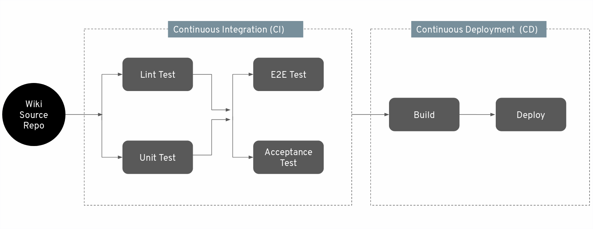

# A Wikipedia like minimalistic service
This is a simiple Wikipedia like application written in `golang`, where user can publish and edit the aricles. 
It uses [Tekton pipelines](https://github.com/tektoncd) to automate CI workflow for this application.

# CI/CD workflow


# Developer guide

1. Build a executable binary
    ```
    make build
    ```

2. Execute E2E tests
    ```
    make e2e
    ```
3. Execute accepence tests
    ```
    make acceptance
    ```

 
